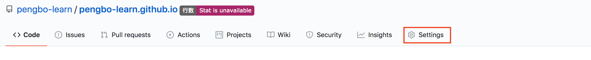
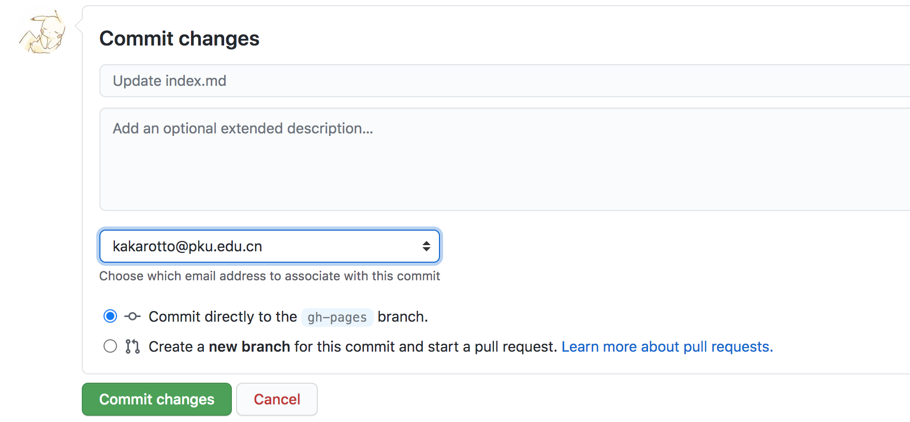
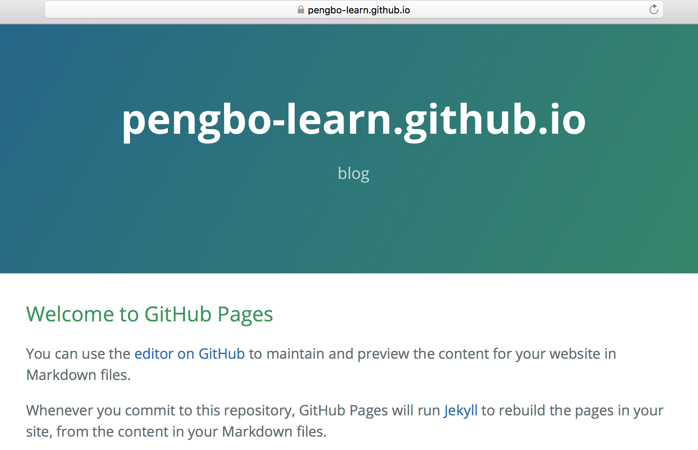
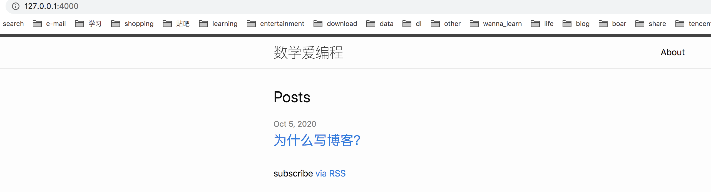
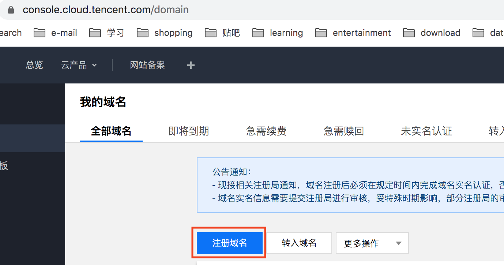
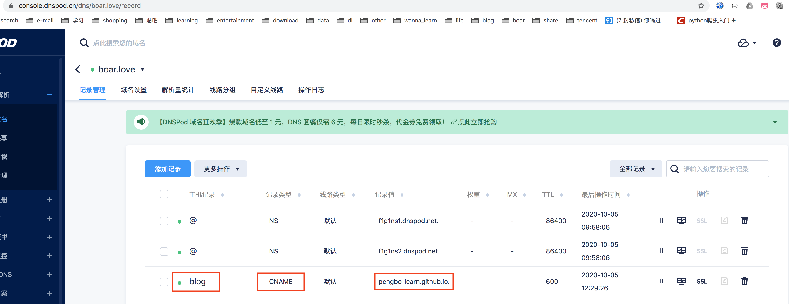

# Blog based on Github Pages

## create github pages

1. Create a repository: username/username.github.io, e.g., pengbo-learn
/pengbo-learn.github.io 

2. Choose a theme in setting, commit to generate index.html.




3. url https://pengbo-learn.github.io will display index.html.


## create blog with jekyll

1. install jekyll on mac
```bash
brew install ruby
gem install jekyll bundler

```

2. init blog with jekyll
```bash
jekyll new . --force
```

3. edit ```_config.yml```, write blog at ```_posts/年-月-日-标题.markdown```, e.g., ```_posts/2020-10-05-why.markdown```.
```bash
# format of post
$ head -6 _posts/2020-10-05-why.markdown 
---
layout: post
title:  "为什么写博客？"
categories: jekyll update
---

```

4. serve with
```bash
bundle exec jekyll serve
```
check the results at ```http://127.0.0.1:4000/```


## support latex
1. create _includes/latex.html to link mathjax
```bash
$ cat _includes/latex.html 
<script src="https://cdn.mathjax.org/mathjax/latest/MathJax.js?config=TeX-AMS-MML_HTMLorMML" type="text/javascript"></script>
```

2. include _includes/latex.html in post as follows:
```bash
$ head -8 _posts/2020-10-05-why.markdown 
---
layout: post
title:  "为什么写博客？"
categories: jekyll update
---



```

## config custom domain
1. purchase domain at dnspod, e.g., mine boar.love costs 25 yuan/year,

2. config a CNAME record
  
3. add custom domain in github setting
  
